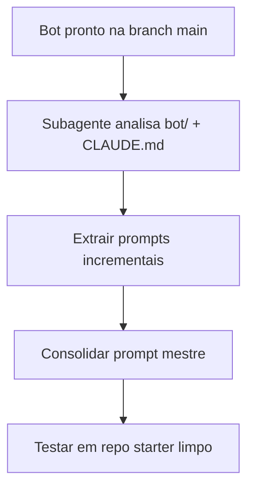

# Prompt Mestre — Bot Telegram B3

Entregável da **Parte 3** do workshop: um único prompt que regenera o bot completo, mais a metodologia de como chegamos aqui (reverse prompt engineering).

---

## Metodologia — reverse prompt engineering

### O que é

Dado um projeto **já funcionando**, reconstruir o menor conjunto de instruções que um humano daria ao Claude Code para chegar no mesmo resultado.

### Passos (usados no workshop)



1. **Analisar** — subagente lê `bot/` e `CLAUDE.md` numa sessão isolada; devolve resumo estruturado.
2. **Decompor** — listar prompts incrementais na ordem que um aluno usaria (CLAUDE.md → comandos → cotação → alerta).
3. **Consolidar** — unificar num prompt mestre autocontido.
4. **Validar** — rodar o prompt mestre num clone limpo da `starter` e comparar com a `main`.

### Prompts usados na Parte 3

**Análise (subagente):**
```
Use um subagente para analisar todo o diretório bot/ e CLAUDE.md.
Liste: arquivos criados, responsabilidade de cada um, dependências entre
módulos, e quais decisões do CLAUDE.md foram aplicadas.
Devolva um resumo estruturado.
```

**Decomposição:**
```
Com base na análise, reconstrua a sequência mínima de prompts que um
aluno usaria para chegar neste bot, na ordem: CLAUDE.md → /start+/help
→ /cotacao → /alerta. Um prompt por etapa, em português simples.
```

**Consolidação:**
```
Consolide tudo num único prompt mestre que, partindo de um repo vazio
com requirements.txt e .env.example, gere o bot completo.
```

---

## Prompts incrementais (referência)

Sequência mínima que reproduz o bot — útil para ensinar antes do prompt mestre:

### 1. Criar CLAUDE.md
```
Leia o README.md. Crie um arquivo CLAUDE.md com as regras do nosso bot
de cotações da B3 no Telegram. Inclua: mensagens em português, preço em
reais com vírgula, usar a API brapi.dev, token do Telegram no .env, e os
comandos /start, /help, /cotacao e /alerta. Crie só o CLAUDE.md por agora.
```

### 2. Bot básico
```
Leia CLAUDE.md. Faça o bot responder /start e /help no Telegram.
O token está no .env. Implemente tudo.
```

### 3. Cotação
```
Leia CLAUDE.md. Faça o comando /cotacao PETR4 mostrar o nome da ação,
o preço em reais e a variação do dia. Implemente tudo.
```

### 4. Alerta
```
Leia CLAUDE.md. Faça o comando /alerta PETR4 35 avisar no Telegram
quando a ação atingir esse preço. Implemente tudo.
```

---

## Prompt mestre (versão consolidada)

Use num clone limpo da branch `starter` (com `requirements.txt`, `.env.example`, venv ativo):

```
Leia o README.md e crie o projeto completo de um bot Telegram de cotações
da B3. Siga estas regras:

CONTEXTO
- Python 3.11+, código async (async def, await)
- Biblioteca: python-telegram-bot v21+ com Application e JobQueue
- HTTP: httpx (async)
- Variáveis no .env via python-dotenv (TELEGRAM_TOKEN obrigatório,
  BRAPI_TOKEN opcional, ALERT_INTERVAL_SECONDS padrão 60)
- Nunca commitar .env

MENSAGENS
- Todas em português
- Preço: R$ 35,42 (vírgula decimal)
- Variação: +1,23% ou -0,45%
- Tickers sempre em MAIÚSCULAS

ESTRUTURA
bot/
├── config.py          # carrega .env
├── main.py            # bootstrap, handlers, JobQueue
├── quotes.py          # integração brapi.dev
└── handlers/
    ├── commands.py    # /start, /help, /cotacao
    └── alerts.py      # /alerta + checagem periódica

API brapi.dev
- GET https://brapi.dev/api/quote/{TICKER}
- Header opcional: Authorization: Bearer {BRAPI_TOKEN}
- Sem token: só PETR4, VALE3, MGLU3, ITUB4
- Campos: results[0].regularMarketPrice, regularMarketChangePercent, shortName

COMANDOS
- /start — boas-vindas em português
- /help — lista de comandos
- /cotacao TICKER — nome, preço formatado, variação; tratar ticker inválido e 401
- /alerta TICKER PRECO — 1 alerta por chat em memória; JobQueue verifica a cada
  ALERT_INTERVAL_SECONDS; quando preço >= limite, envia mensagem no Telegram

Crie também CLAUDE.md com essas regras para sessões futuras.
Implemente tudo. O projeto deve rodar com: python -m bot.main
```

---

## Como validar o prompt mestre

```bash
# repo limpo
git clone -b starter git@github.com:mateuscqueiros/telegram-stock-bot.git teste-prompt
cd teste-prompt
python -m venv .venv
source .venv/Scripts/activate   # Windows: source .venv/Scripts/activate
pip install -r requirements.txt
cp .env.example .env            # preencher TELEGRAM_TOKEN

# sessão nova
/clear
claude "[cole o prompt mestre acima]"

# validar
python -m bot.main
# /start /help /cotacao PETR4 /alerta PETR4 0.01
```

Compare com a branch `main`. Diferenças de estilo são OK; funcionalidade deve ser equivalente.

---

## Débito técnico conhecido (mencionar na Parte 3)

| Item | Status | Melhoria futura |
|---|---|---|
| Alertas em memória | Perde ao reiniciar | Persistir em SQLite ou Redis |
| Polling | OK para demo | Webhook em produção |
| Sem Dockerfile | Só doc | Gerar na Parte 3 |
| Sem testes automatizados | Manual via Telegram | pytest + mocks |

---

## Para o palestrante

- Mostre primeiro os **prompts incrementais** (Parte 2) — o aluno entende o caminho.
- Depois revele o **prompt mestre** — o aluno entende a consolidação.
- Use **subagente** na análise para demonstrar economia de contexto.
- Feche com o hábito de gravar memória antes de encerrar a sessão.
